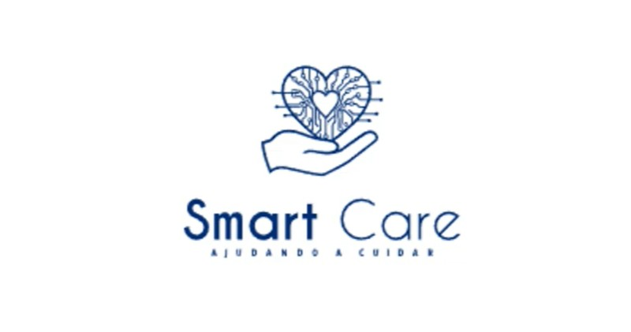

# 🧠 SmartCare  

## 🎥 Demonstração do Projeto  
  
> Clique na imagem para assistir à demonstração do projeto SmartCare no YouTube.

---

## 💡 Sobre o Projeto  
O **SmartCare** é um sistema inteligente de monitoramento voltado ao cuidado de idosos e pessoas em situação de vulnerabilidade.  

Ele utiliza sensores conectados a um **ESP32**, capazes de medir temperatura corporal sem contato, detectar movimento, quedas e distância.  
Esses dados são enviados em tempo real para um painel web e aplicativo móvel, proporcionando mais segurança e autonomia no acompanhamento do bem-estar do usuário.

---

## ⚙️ Tecnologias Utilizadas  
| Categoria | Tecnologias |
|------------|--------------|
| 💻 **Linguagens** | C++ (Arduino/ESP32), JavaScript, HTML, CSS |
| 🧩 **Plataformas IoT** | Adafruit IO (versão inicial), Node.js (backend), React (frontend) |
| 🔌 **Sensores** | MLX90614 (temperatura sem contato), MAX30102 (opcional), PIR HC-SR501 (movimento), HC-SR04 (distância) |
| 🌐 **Comunicação** | Wi-Fi, MQTT |
| 🖥️ **Display** | OLED SSD1306 |
| 💾 **Microcontrolador** | ESP32 |

---

## 🖼️ Interface e Protótipo  
> Imagens ilustrativas do funcionamento do projeto (hardware e software)

- Dashboard personalizado  
- Animações no display OLED  
- Indicadores de movimento, temperatura e quedas  
- LED RGB para indicar risco (vermelho) ou normalidade (verde)  

---

## 🧱 Estrutura do Repositório  
SmartCare/
│
├── media/ # Imagens, vídeos e ícones do projeto
├── docs/ # PDFs, relatórios e roteiros de apresentação
├── exemplo_codigo/ # Trecho ilustrativo do código (opcional)
└── README.md # Descrição geral do projeto

---

## 🔒 Código-Fonte
> O código completo do sistema está disponível em **repositório privado** para proteger a autoria do projeto.  
> Caso você seja professor, avaliador ou recrutador e deseje acesso, entre em contato comigo via [LinkedIn](https://www.linkedin.com/in/crislei-jenuino-b3407734a/).  

---

## 👩‍💻 Desenvolvido por  
O projeto **SmartCare** foi desenvolvido por mim, **Crislei Jenuino**, junto com a **turma do TCC do curso de Redes de Computadores da ETEC Prof. Massuyuki Kawano**.  

📍 Curso de Redes de Computadores – ETEC Prof. Massuyuki Kawano  
🌐 [LinkedIn](https://www.linkedin.com/in/crislei-jenuino-b3407734a/) • [Instagram](https://www.instagram.com/crisleikeli) • [YouTube](https://www.youtube.com/@seu_canal)

---

## 🌱 Licença  
Este projeto está sob a licença Creative Commons BY-NC-SA.  
> Você pode usar e compartilhar com atribuição, mas **não** pode usar comercialmente nem modificar sem permissão.

---

## 💬 Agradecimentos  
Agradecemos à **ETEC Prof. Massuyuki Kawano**, ao **Centro Paula Souza** e à equipe da **turma do TCC de Redes de Computadores R124** por todo apoio no desenvolvimento do projeto e na participação na **FETEPS**.