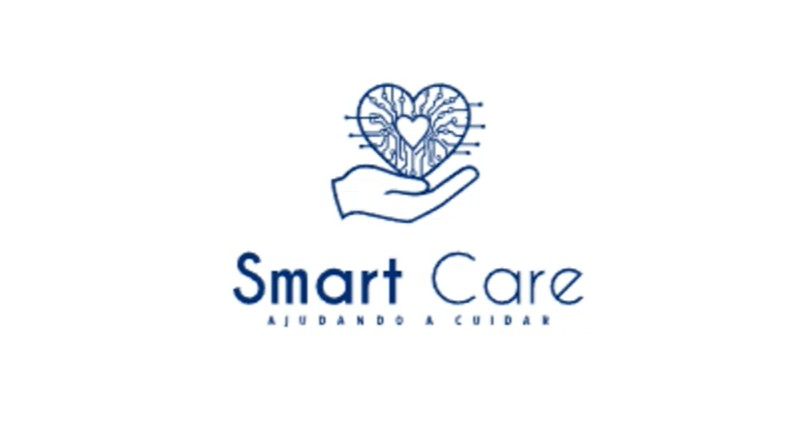

# 🩺 SmartCare  


## 🎬 Demonstração do Projeto  
<table>
	<tr>
		<td width="360" valign="top">
			<a href="https://www.youtube.com/watch?v=6QugrVdtrRk">
				
			</a>
		</td>
		<td valign="middle">
			<strong>▶️ Assista à demonstração no YouTube</strong><br/>
			➡️ Clique na imagem ao lado para abrir o vídeo do SmartCare.<br/><br/>
			<a href="https://www.youtube.com/watch?v=6QugrVdtrRk">
				
			</a>
		</td>
	</tr>
</table>

---

## ℹ️ Sobre o Projeto  
O **SmartCare** é um sistema inteligente de monitoramento voltado ao cuidado de idosos e pessoas em situação de vulnerabilidade.  

Ele utiliza sensores conectados a um **ESP32**, capazes de medir temperatura corporal sem contato, detectar movimento, quedas e distância.  
Esses dados são enviados em tempo real para um painel web e aplicativo móvel, proporcionando mais segurança e autonomia no acompanhamento do bem-estar do usuário.

---

## 🛠️ Tecnologias Utilizadas  
| Categoria | Tecnologias |
|------------|--------------|
| 💻 **Linguagens** | C++ (Arduino/ESP32) |
| 🧩 **Plataformas IoT** | Adafruit IO (versão inicial) |
| 🔌 **Sensores** | MLX90614 (temperatura sem contato), MAX30102 (opcional), PIR HC-SR501 (movimento), HC-SR04 (distância) |
| 🌐 **Comunicação** | Wi-Fi, MQTT |
| 🖥️ **Display** | OLED SSD1306 |
| 💾 **Microcontrolador** | ESP32 |

---

## 🖥️ Interface e Protótipo  
> Imagens ilustrativas do funcionamento do projeto (hardware e software)

- Dashboard personalizado  
- Animações no display OLED  
- Indicadores de movimento, temperatura e quedas  
- LED RGB para indicar risco (vermelho) ou normalidade (verde)  

Materiais incluídos neste repositório:
- [docs/Projeto_SmartCare.pdf](docs/Projeto_SmartCare.pdf) (documentação)
- [docs/SmartCare Prototipagem.ppsx](docs/SmartCare%20Prototipagem.ppsx) (protótipo/apresentação)
- [exemplo_codigo/demo.ino.ino](exemplo_codigo/demo.ino.ino) (trecho ilustrativo do firmware)

---

## 🗂️ Estrutura do Repositório  
```text
SmartCare/
├── docs/                 # Documentação e materiais
│   ├── Projeto_SmartCare.pdf
│   └── SmartCare Prototipagem.ppsx
├── exemplo_codigo/        # Trecho ilustrativo do código
│   └── demo.ino.ino
├── media/                 # Imagens do projeto
│   ├── SmartCare_thumb.jpg
│   ├── feteps.jpg
│   └── feteps 1.jpg
├── LICENSE
└── README.md
```

---

## 🔒 Código-Fonte
> Este repositório público é uma vitrine com documentação/mídia e um **exemplo de código**.  
> O código completo do sistema (firmware + painel web/app) está disponível em **repositório privado** para proteger a autoria do projeto.  
> Caso você seja professor, avaliador ou recrutador e deseje acesso, entre em contato comigo via [LinkedIn](https://www.linkedin.com/in/crislei-jenuino-b3407734a/).  

---

## 👩‍💻 Desenvolvido por  
O projeto **SmartCare** foi desenvolvido por mim, **Crislei Jenuino**, junto com a **turma do TCC do curso de Redes de Computadores da ETEC Prof. Massuyuki Kawano**.  

📍 Curso de Redes de Computadores – ETEC Prof. Massuyuki Kawano  
🌐 [](https://www.linkedin.com/in/crislei-jenuino-b3407734a/)
[](https://www.instagram.com/crisleikeli)

---

## 📄 Licença  
Este projeto está sob **direitos reservados (All rights reserved)**, conforme descrito em [LICENSE](LICENSE).  
> Não é permitido copiar, modificar, distribuir ou utilizar sem permissão explícita por escrito da autora.

---

## 🙏 Agradecimentos  
Agradecemos à **ETEC Prof. Massuyuki Kawano**, ao **Centro Paula Souza** e à equipe da **turma do TCC de Redes de Computadores R124** por todo apoio no desenvolvimento do projeto e na participação na **FETEPS**.